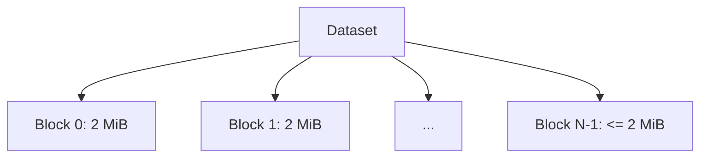
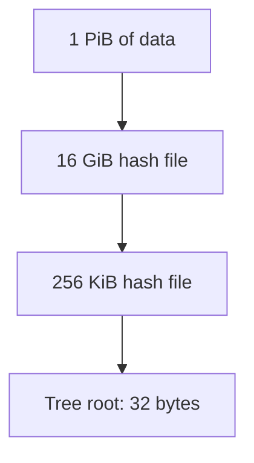
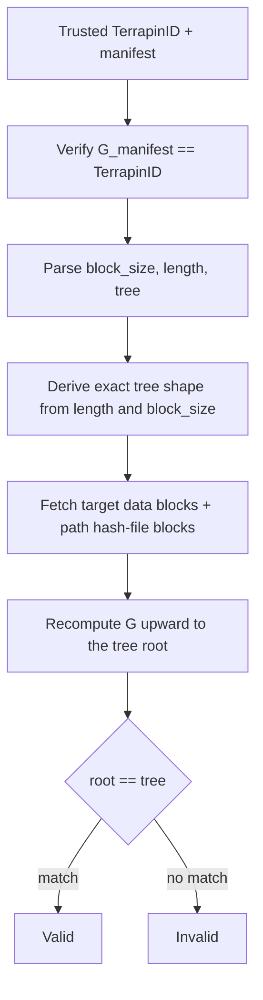

# Terrapin Specification

Status: Draft
Author: Frederick F. Kautz IV
Version: 0.3

WIP Implementations:
* https://github.com/fkautz/terrapin-rs
* https://github.com/fkautz/terrapin-go

> v0.3 is a breaking change to the identifier. The Terrapin identifier is now the GitOID of a canonical root manifest, not the bare recursive tree root. See section 9 for what changed and why, and section 8 for migration.

---

## 1.0 Introduction

Terrapin is a hashing algorithm for efficiently and securely hashing extremely large datasets in parallel. As data volumes grow into the petabyte range and beyond, sequential hashing becomes impractical. Terrapin uses a divide-and-conquer construction that enables parallel hashing and efficient validation of arbitrary slices without processing the whole dataset.

A Terrapin identifier is a single 32-byte digest that cryptographically commits to the dataset's content, its length, the block size, and the hash algorithm. The identifier is the GitOID of a small canonical manifest, so a dataset's identity is fully self-describing and cannot be reinterpreted at a different size or tree height.

---

## 2.0 Core Concepts

### 2.1 Parallel processing

The dataset is divided into fixed-size blocks that can be hashed independently. Multiple processors or machines hash blocks simultaneously, and each layer of the recursive structure is itself block-parallel.

### 2.2 Recursive hashing

A single hashing primitive (GitOID SHA-256) is applied recursively, producing a hierarchical structure whose integrity collapses to one tree root. The layering is a total function of dataset length and block size: for a given input there is exactly one tree.

### 2.3 Efficient validation

Any slice can be validated by recomputing a bounded set of hashes from the relevant data blocks up to the tree root, without touching the rest of the dataset.

### 2.4 Self-describing identity

The tree root is wrapped in a canonical manifest committing the algorithm, block size, and total length. The GitOID of that manifest is the Terrapin identifier. Only this 32-byte identifier needs a trusted channel; the manifest itself rides alongside and is self-verifying.

---

## 3.0 Parameters

These parameters are fixed for the `terrapin-sha256` profile.

```
algorithm:   terrapin-sha256
block size:  2097152 bytes (exactly; this is 2 MiB, not 2,000,000)
leaf hash:   gitoid-sha256
node hash:   gitoid-sha256
digest:      terrapin-sha256:<64 lowercase hex>
```

The block size is exactly 2,097,152 bytes. Implementations MUST NOT interpret "2 MB" as 2,000,000 bytes; a decimal/binary mismatch produces a different identifier.

GitOID SHA-256 is defined as:

```
G(data) = sha256("blob " + decimal(len(data)) + "\0" + data)
```

where `decimal(n)` is the base-10 ASCII representation of `n` with no leading zeros, and `\0` is a single NUL byte. `G(data)` is 32 bytes.

Example:

```
G("hello world") = sha256("blob 11\0hello world")
```

Design note: the `blob <len>\0` framing binds the input length into the digest, which detects silent short writes and truncation at the hasher.

---

## 4.0 Tree Construction

The tree construction produces the recursive **tree root**. The tree root is an intermediate value. It is not a Terrapin identifier on its own; only the manifest GitOID (section 5) is an identifier.

### 4.1 Splitting

The dataset is split into blocks of exactly 2,097,152 bytes. The final block MAY be smaller. A dataset of length 0 has no data blocks.



### 4.2 Leaf hashing

Each data block is hashed with `G`. The resulting 32-byte hashes are stored sequentially, raw, with no encoding. Each occupies exactly 32 bytes. The concatenation is the **hash file** for that layer.

### 4.3 Recursive hashing

The recursion is deterministic. There is no optional layer-skipping.

```
T(data):
    if len(data) <= 2097152:
        return G(data)                       # single block, including the empty case
    blocks    = split(data, 2097152)         # final block may be smaller
    hash_file = concat(G(b) for b in blocks) # 32 bytes per block, raw
    return T(hash_file)                       # recurse on the hash file
```

`T` terminates because each level shrinks the input by a factor of approximately 65,536 (block size divided by hash size). The tree root is `T(dataset)`.

Determinism requirement: for a given dataset and the fixed block size, `T` produces exactly one tree root. Implementations MUST NOT skip, collapse, or otherwise vary intermediate layers. The number of layers is a total function of dataset length.



Worked layering for a 1 PiB dataset:

```
Dataset: 1 PiB (1,125,899,906,842,624 bytes; 536,870,912 blocks of 2 MiB)
Layer 1: 16 GiB  (17,179,869,184 bytes;       8,192 blocks of 2 MiB)
Layer 2: 256 KiB (262,144 bytes;              1 block, < 2 MiB)
Tree root: G(Layer 2) = 32 bytes
```

---

## 5.0 Root Manifest

The Terrapin identifier is the GitOID of a canonical root manifest. The manifest commits the algorithm, block size, dataset length, and tree root in one object.

### 5.1 Fields

The manifest is an ASCII, LF-terminated, `key: value` document with a fixed field order:

```
terrapin: sha256
block_size: 2097152
length: 1203942
tree: <64 lowercase hex of the tree root>
```

| field        | meaning                                                        |
|--------------|----------------------------------------------------------------|
| `terrapin`   | algorithm identifier; type tag for the manifest                |
| `block_size` | block size in bytes (2097152 for this profile)                 |
| `length`     | total dataset length in bytes                                  |
| `tree`       | the recursive tree root `T(dataset)`, 64 lowercase hex         |

### 5.2 Canonical encoding

The manifest is an identifier only if its encoding is total. A manifest that does not parse to exactly this canonical form MUST be rejected. Do not normalize-then-accept; reject.

```
ENC-1: Character set is US-ASCII.
ENC-2: Every line, including the last, is terminated by a single LF (0x0A).
ENC-3: Each line is "<key>: <value>" with exactly one space after the colon,
       no leading whitespace, and no trailing whitespace before the LF.
ENC-4: Field order is exactly: terrapin, block_size, length, tree.
ENC-5: Each key is lowercase ASCII and appears exactly once. No unknown keys,
       no comments, no blank lines.
ENC-6: Integer values are decimal with no leading zeros (the value zero is "0"),
       no sign, and no separators.
ENC-7: The tree value is exactly 64 lowercase hex characters [0-9a-f].
ENC-8: The terrapin value is the algorithm identifier, "sha256" for this profile.
ENC-9: No fields beyond the four defined above appear in the hashed form.
       Extensions, if any, live outside the hashed manifest.
```

### 5.3 Identifier

```
manifest    = the canonical bytes above
TerrapinID  = G(manifest)
digest      = "terrapin-sha256:" + hex(TerrapinID)
```

The `terrapin:` header makes the manifest bytes distinct from any plausible data block, and the identifier is always `G(manifest)`, never the bare tree root. A dataset of any other length or content yields a different manifest and therefore a different identifier. This is what makes the identifier unambiguous about tree height and size.

### 5.4 Example

For a 1,203,942-byte dataset (one full 2 MiB block is larger than this, so the dataset is a single block and the tree root is `G(dataset)`):

```
terrapin: sha256
block_size: 2097152
length: 1203942
tree: 9a31b4f0...c2  (64 hex; = G(dataset))
```

The 28-byte two-field fragment `alg: sha256\nlength: 1203942\n` is not a valid manifest; it omits the type header, the block size, and the tree root. The full four-field form above is required.

---

## 6.0 Validation

Validation starts from the trusted identifier and the manifest, then walks the tree.



1. Obtain the trusted `TerrapinID` (the 32-byte value distributed through a trusted channel, for example a signed attestation) and the manifest (any channel).
2. Verify `G(manifest) == TerrapinID`. Reject on mismatch or non-canonical encoding. Parse `block_size`, `length`, and `tree`.
3. Derive the exact tree shape from `length` and `block_size`. This fixes the number of layers and the exact size of every block at every layer, including partial final blocks. No information about shape is taken from the data itself.
4. To validate a byte range, identify the data block(s) covering it, then fetch the containing hash-file block at each layer up to the tree root.
5. Recompute `G` upward and verify the top equals `tree`.

Path note: because each node is `G` over a full block, the "path" at each layer is the full hash-file block that contains the relevant hashes, not a single sibling hash. For datasets up to 128 GiB the entire structure above the data is a single hash-file block (at most 2 MiB) plus the tree root, so one block fetch authenticates a 128 GiB contiguous region. Hash-file blocks SHOULD be cached aggressively; they are small relative to the data they authenticate and they amortize across all reads in their region.

### 6.1 Worked validation

Validate the 2 MiB data block at index 250,000,000 in the 1 PiB dataset above.

```
Data block:    layer 0, index 250,000,000 (fetch 2 MiB)
Layer 1 block: index floor(250,000,000 / 65,536) = 3,814 (fetch 2 MiB)
               leaf 250,000,000 sits at position 250,000,000 - 3,814*65,536 = 45,696
Layer 2 block: the single 256 KiB hash file (fetch 256 KiB)
Tree root:     G(layer 2 block); compare to manifest "tree"
Identifier:    G(manifest); compare to trusted TerrapinID
```

Data transferred to validate one 2 MiB block: 2 MiB (data) + 2 MiB (layer 1 block) + 256 KiB (layer 2) + the manifest. The layer 1 block authenticates all 65,536 leaves in its 128 GiB region, and the layer 2 block authenticates the whole dataset, so both amortize across subsequent reads.

---

## 7.0 Security Considerations

- The identifier commits the algorithm, block size, and total length. Two datasets that differ in any of these produce different manifests and therefore different identifiers. The height/size reinterpretation that affects a bare tree root does not apply: a tall tree's identifier cannot equal that of a small dataset whose content happens to equal an upper hash-file block, because identifiers are `G(manifest)` and the manifests differ in `length` and `tree`.
- Only the 32-byte identifier requires a trusted channel. The manifest is self-verifying against it, so the length and parameters can be transported untrusted; tampering causes the recompute to fail.
- The canonical manifest encoding is mandatory. Non-canonical manifests MUST be rejected rather than normalized, or the identifier stops being a function of content.
- Layering is a total function of `(length, block_size)`. A dataset has exactly one identifier. There is no operator discretion over the tree shape.
- The `blob <len>\0` GitOID framing binds each node's input length, detecting truncation and short writes at every level.
- The recursive structure ensures any change to the dataset, however small, propagates to the tree root and thus to the identifier.
- The identifier MUST be distributed through trusted channels, as it anchors the integrity of the entire dataset.

---

## 8.0 Compatibility and Migration

v0.3 changes the identifier. In v0.2 the identifier was the bare recursive tree root; in v0.3 it is `G(manifest)`. The two are different 32-byte values for the same dataset.

- The recursive tree construction (section 4) is unchanged from v0.2 except that optional layer-skipping is removed and the block size is pinned to exactly 2,097,152 bytes.
- Consumers of v0.2 identifiers must recompute v0.3 identifiers; there is no in-place upgrade of the digest value.

---

## 9.0 Changes from v0.2

1. The identifier is now the GitOID of a canonical root manifest (section 5), not the bare tree root. The manifest commits algorithm, block size, dataset length, and tree root, so the identifier is self-describing and unambiguous about size and tree height.
2. Optional layer-skipping is removed (section 4.3). Layering is a total function of dataset length and block size, so a dataset has exactly one tree and one identifier.
3. The block size is pinned to exactly 2,097,152 bytes (section 3.0), removing the decimal/binary ambiguity.
4. The validation process starts from the manifest and derives tree shape from committed parameters (section 6). The worked validation example uses corrected indices.
5. A canonical manifest encoding is specified and is mandatory (section 5.2).

---

## 10.0 Performance Characteristics

- The construction is block-parallel at every layer; hashing throughput scales with available processors or machines.
- Validation cost for a slice is bounded by the slice plus one hash-file block per layer, and the number of layers grows logarithmically (base 65,536) in dataset size: three layers at 1 PiB.
- Hash-file blocks amortize: one 2 MiB layer-1 block authenticates a 128 GiB contiguous region, so sequential and clustered access patterns pay near-zero marginal verification overhead after the first fetch.
- For small datasets the recursion bottoms out immediately (`length <= 2097152` yields `tree = G(dataset)`), so the only overhead beyond a single GitOID is the manifest wrap.


